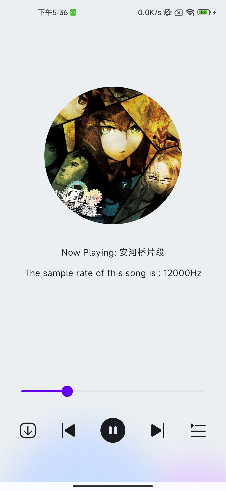
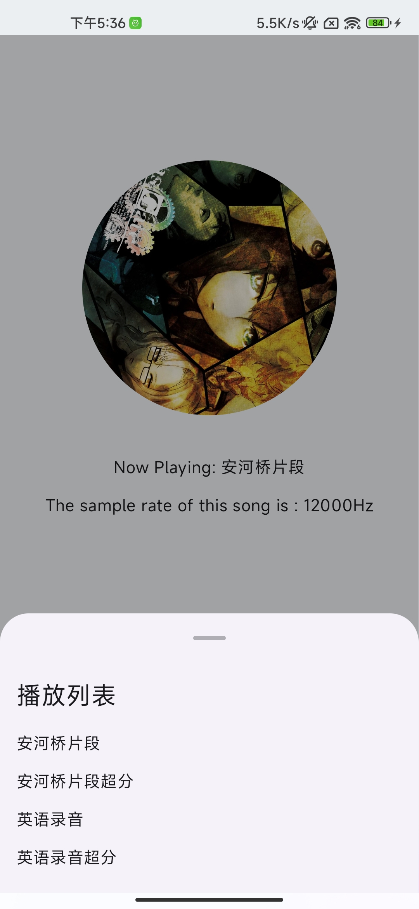
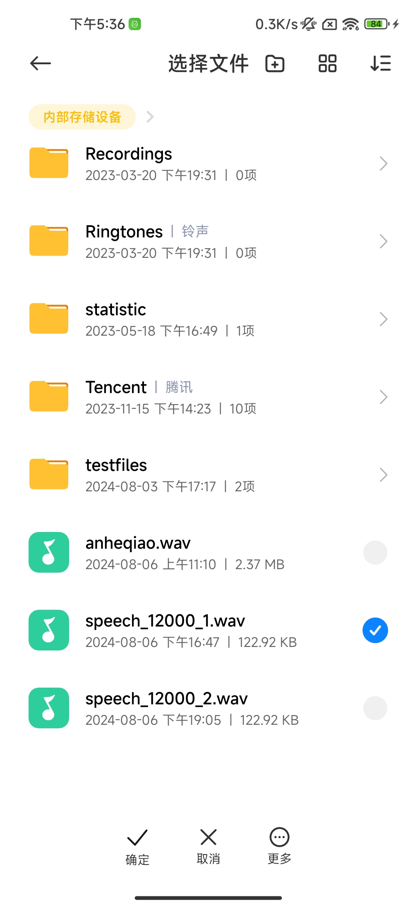
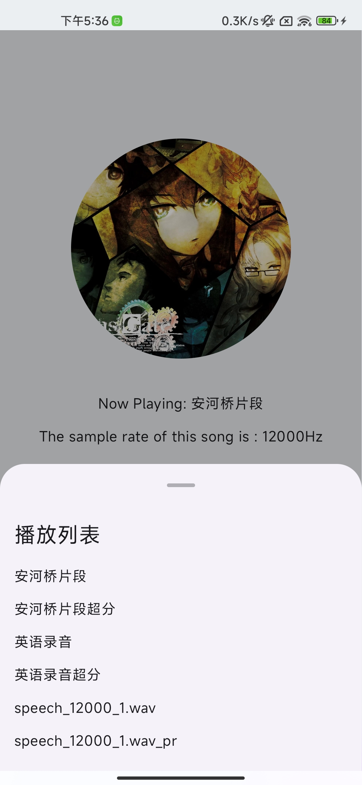

# audioSuperResolutionDeployInAndroid
A audio Super Resolution Deploy In Android

这个app可以读取你手机的音频到播放列表，并将其进行超分，得到高分辨率的音乐，模型文件在asset文件夹下
运行截图如下所示：

我在app里预存了四首超分前后的歌曲供用户去体验超分的效果，用户可以自行点击左下角的button导入本地歌曲，这将会把低采样率的歌曲和超分后的歌曲同时添加到播放列表，让用户感受超分自己的歌曲。

